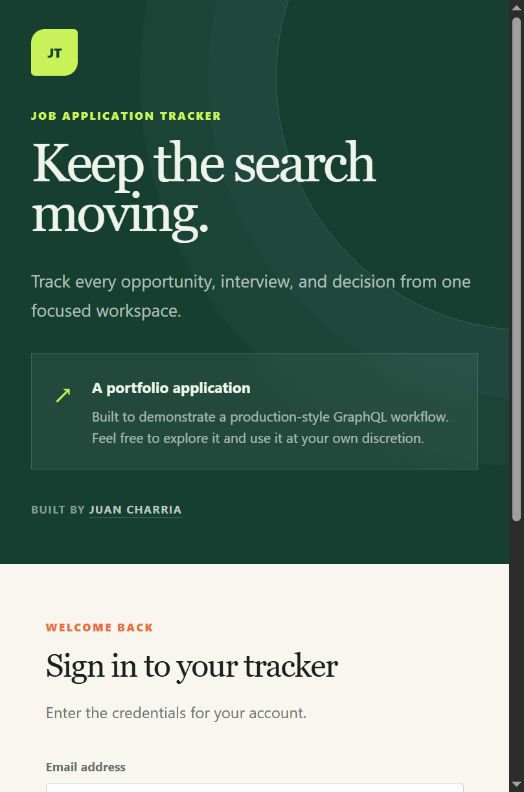
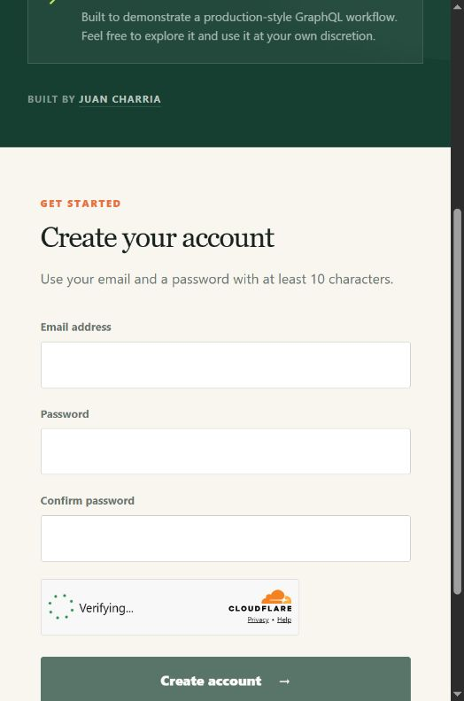
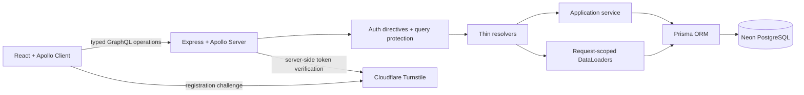

# GraphQL Job Tracker

A production-style job application tracker built to demonstrate a complete
GraphQL workflow: schema design, typed client operations, authentication,
authorization, relational data, pagination, caching, testing, and deployment.

[](https://github.com/justjuank/graphql-job-tracker/actions/workflows/ci.yml)
[](https://justjuank-graphql-job-tracker.onrender.com/)
[](https://www.apollographql.com/)
[](https://www.typescriptlang.org/)

**[Open the live application](https://justjuank-graphql-job-tracker.onrender.com/)** ·
**[API health check](https://justjuank-graphql-job-tracker-api.onrender.com/health)**

> The API runs on Render's free tier and may need about a minute to wake after
> a period of inactivity. Production has no seeded demo account; create your
> own account from the registration screen.

## Product preview

| Sign in | Protected registration |
| --- | --- |
|  |  |

Once authenticated, users can create and filter applications, track the
original job-posting URL, update each opportunity's status, schedule interviews,
and delete applications from a responsive dashboard.

## What this project demonstrates

- Schema-first GraphQL API with queries, mutations, enums, input types,
  relationships, payloads, nullability, and a custom `DateTime` scalar
- React and Apollo Client frontend with generated typed documents—no
  handwritten mirror types for operation results or variables
- PostgreSQL persistence through Prisma with version-controlled migrations
- Registration and login using salted password hashes and signed access tokens
- Per-user record ownership plus declarative `@authenticated` and
  `@requiresRole` authorization directives
- Request-scoped DataLoader batching to prevent relationship N+1 queries
- Cursor-based pagination with composable status, company, and role filters
- Optimistic status updates through Apollo's normalized cache
- Query depth, recursive-field, node-count, and variable-aware complexity limits
- Cloudflare Turnstile and per-IP registration throttling for public deployment
- API integration tests and React component tests in PostgreSQL-backed CI
- Automatic deployment of the API and static client through a Render Blueprint

## Architecture



The GraphQL schema is the shared contract. Apollo Server exposes that contract,
while GraphQL Code Generator validates the client's operations against it and
produces `TypedDocumentNode` values. Prisma remains behind services and loaders;
the React client never knows how the data is stored.

## Technology stack

| Layer | Technology |
| --- | --- |
| Client | React 19, Apollo Client, TypeScript, Vite, Tailwind CSS |
| API | Node.js, Express 5, Apollo Server 5, GraphQL.js |
| Data | Prisma, PostgreSQL, DataLoader |
| Security | Signed bearer tokens, scrypt, schema directives, Turnstile |
| Quality | Node test runner, Vitest, Testing Library, GraphQL Code Generator, oxlint |
| Delivery | GitHub Actions, Render, Neon |

## Key engineering decisions

### Thin resolvers, explicit services

Resolvers translate GraphQL fields into application calls. Validation,
ownership checks, and mutation rules live in `ApplicationService`, which keeps
business behavior reusable without adding a repository layer that would merely
mirror Prisma.

### Authorization at two levels

Schema directives enforce broad field policies:

```graphql
type Query {
  applications: [JobApplication!]! @authenticated
  users: [User!]! @requiresRole(role: ADMIN)
}
```

The service layer separately scopes every application lookup by the current
user. A valid token therefore cannot be used to read or mutate another user's
records by guessing an ID.

### Batching relationship fields

GraphQL field resolvers make nested data convenient, but resolving `company`
and `interviews` once per application can create an N+1 query pattern.
Request-scoped DataLoaders collect keys during one execution turn and replace
those individual lookups with set-based Prisma queries. Their caches are
discarded after every request and never shared between users.

### Cursor pagination

`applicationPage` returns edges and `pageInfo` rather than relying on numeric
offsets. The opaque cursor gives clients a stable continuation point while
allowing the API to change its internal representation later.

```graphql
query ApplicationPage(
  $first: Int!
  $after: String
  $filter: ApplicationFilter
) {
  applicationPage(first: $first, after: $after, filter: $filter) {
    edges {
      cursor
      node {
        id
        role
        jobPostingUrl
        status
        company { name }
      }
    }
    pageInfo { hasNextPage endCursor }
  }
}
```

### Generated client types

Client operations live beside the features that consume them. GraphQL Code
Generator reads `src/schema.ts`, validates every operation, and generates typed
documents in `client/src/gql/`. Apollo hooks then infer both result and variable
types directly from each document.

```bash
npm --prefix client run codegen
```

Generated files should not be edited by hand. Generation runs automatically
before client development and production builds.

### Defense in depth

The public API combines several small controls:

- Strict request authentication and ownership checks
- Role authorization through transformed schema directives
- Depth, recursive traversal, node-count, and operation-complexity limits
- Page-size-aware cost calculation using GraphQL variables
- Restricted production CORS and request-size limits
- Turnstile verification plus registration throttling
- HTTP/HTTPS-only validation for user-supplied job-posting links

Schema introspection remains available in local development for Apollo Sandbox
and Postman autocomplete, but is disabled in production.

## Run locally

### Prerequisites

- Node.js 20 or newer
- Docker Desktop
- npm

### 1. Configure the environment

Copy `.env.example` to `.env` and `client/.env.example` to
`client/.env.local`. Replace `JWT_SECRET` with a private value containing at
least 32 characters. The checked-in Turnstile values are Cloudflare's published
test keys and are intended only for local development and automated testing.

### 2. Install and prepare the database

```bash
npm install
npm --prefix client install
npm run db:up
npm run db:deploy
npm run db:seed:demo
```

Docker exposes PostgreSQL on port `5433` to avoid common conflicts with a local
instance on `5432`. The demo seed resets only the local database and refuses to
run when `NODE_ENV=production`.

### 3. Start both applications

Run the API and client in separate terminals:

```bash
npm run dev
```

```bash
npm run dev:client
```

- React client: <http://localhost:5173>
- GraphQL endpoint and Apollo Sandbox: <http://localhost:4000/graphql>
- Health check: <http://localhost:4000/health>

The local seed creates this development-only account:

```text
Email: demo@example.com
Password: portfolio-demo-password
```

Run `npm run db:down` when finished. The Docker volume preserves data between
runs.

## Example mutation

Protected operations require the token returned by `login` or `register` as a
bearer token.

```graphql
mutation CreateApplication($input: CreateApplicationInput!) {
  createApplication(input: $input) {
    id
    role
    jobPostingUrl
    status
    company { name }
  }
}
```

```json
{
  "input": {
    "companyName": "Initech",
    "role": "Software Engineer",
    "jobPostingUrl": "https://initech.example/jobs/software-engineer",
    "status": "SAVED"
  }
}
```

For partial updates, omitted fields remain unchanged. The required fields reject
explicit `null`; the optional `jobPostingUrl` intentionally accepts `null` so a
user can remove an existing link.

## Test and validate

The integration suite uses the `job_tracker_test` PostgreSQL database from the
local Docker service. GitHub Actions provisions the same database engine as an
isolated service container.

```bash
npm run typecheck
npm test
npm --prefix client run lint
npm --prefix client test
npm --prefix client run build
```

The current suites cover authentication, authorization, owner isolation,
pagination, filtering, relationship batching, query protection, Turnstile
verification, GraphQL errors, cache behavior, and the principal UI workflows.

## Production deployment

[`render.yaml`](render.yaml) declares two Render services:

- A Node web service for the GraphQL API
- A static site for the React application

The API connects to Neon PostgreSQL and applies committed migrations with
`prisma migrate deploy`; production never runs the demo seed. Cloudflare
Turnstile protects self-service registration. Pushes to `main` run the full
GitHub Actions validation workflow before Render deploys the new version.

Required production secrets are configured in the hosting dashboards and are
not committed:

- `DATABASE_URL`
- `JWT_SECRET`
- `TURNSTILE_SECRET_KEY`
- `VITE_TURNSTILE_SITE_KEY`

## Project map

```text
src/schema.ts              GraphQL contract
src/resolvers.ts           Root and relationship resolvers
src/context.ts             Per-request identity, loaders, and services
src/directives/            Authentication and role enforcement
src/services/              Validation and ownership-scoped mutations
src/loaders.ts             Request-scoped relationship batching
src/pagination.ts          Opaque cursor encoding and validation
src/query-protection.ts    Depth and variable-aware complexity policies
src/turnstile.ts           Server-side challenge verification
client/src/applications/   Application operations and workflows
client/src/dashboard/      Filters, summaries, list, and pagination
client/src/gql/            Generated typed GraphQL documents
prisma/                    Schema and version-controlled migrations
test/                      PostgreSQL-backed API integration tests
.github/workflows/ci.yml   API and client validation
render.yaml                Production deployment blueprint
```

## Author

Designed and built by [Juan Charria](https://github.com/justjuank) as a
portfolio project for learning and demonstrating production-oriented GraphQL.
